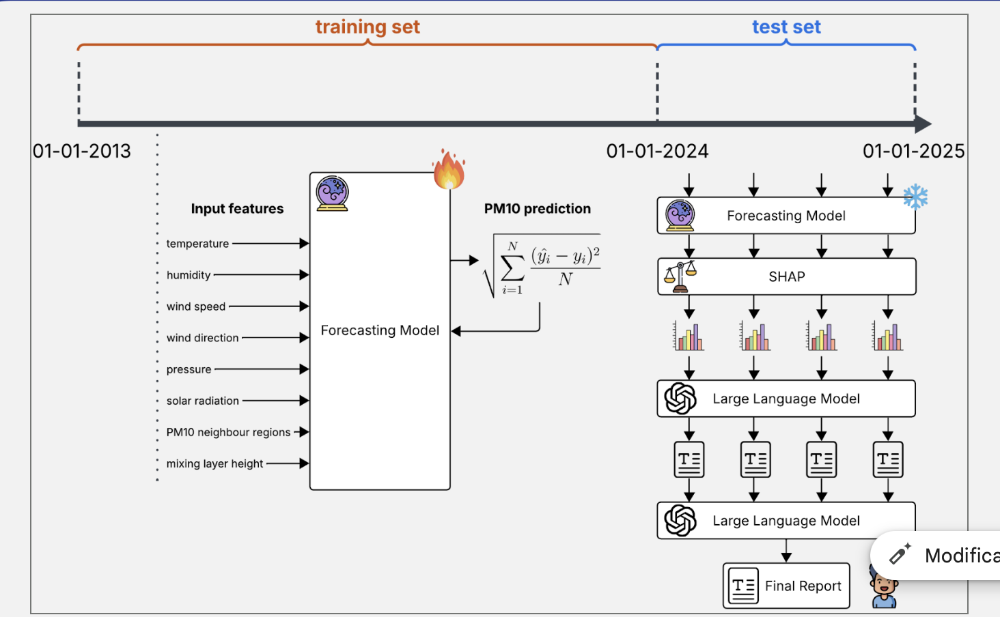

# APPA Chinquinaria: Air Quality Analysis and Forecasting Framework
<div align="center">
  
  
  
  
  
  
</div>

---

**Authors**: Alberto Catalano, Alessandro Delle Site, Elisa Negrini, Ettore Miglioranza, Federico Rubbi, Nicolò Cecchin, Stefano Genetti

**Supervisors/Partners**: Elena Tomasi (FBK), Elisa Malloci (Provincia TN), Massimo Cassiani (UniTN)

## Context and Collaboration

This framework was developed within the scope of the **Public AI Challenge**, an open innovation initiative designed to apply artificial intelligence to real-world problems in the public sector. The project is the result of a strategic collaboration between **Hub Innovazione Trentino (HIT)**, the **University of Trento**, and the **Autonomous Province of Trento**.

The primary objective was to design and implement a robust analytical pipeline for the forecasting and explainability of air quality data, specifically addressing the operational needs of the **Agenzia provinciale per la protezione dell'ambiente (APPA)**. A comprehensive technical report documenting the complete methodology and results is available [here](assets/Report.pdf).

### The Initiative

**Public AI Challenge**
The [Public AI Challenge](https://www.trentinoinnovation.eu/innovate/innovation-tools/public-ai-challenge/?lang=en) is an open innovation program that connects public administrations with the research ecosystem to solve complex challenges using advanced data science and machine learning techniques. In this specific iteration, the challenge assigned to us focused on developing predictive models for environmental monitoring, requiring the integration of heterogeneous data sources and the application of explainable AI methodologies to support decision-making processes.

**Hub Innovazione Trentino (HIT)**
[HIT](https://www.trentinoinnovation.eu/) is a foundation dedicated to promoting technology transfer and innovation in the Trentino region. Acting as a bridge between scientific research and the market, HIT valorizes the results of its founding members—including the University of Trento and Fondazione Bruno Kessler—to foster economic and social development. In this project, HIT facilitated the definition of the challenge and the coordination between the research team and the public stakeholder.

### The Client Agency

**Agenzia Provinciale per la Protezione dell'Ambiente (APPA)**
[APPA](https://www.appa.provincia.tn.it/) is the technical-scientific body of the Autonomous Province of Trento responsible for environmental protection and control. The agency's mandate includes monitoring the state of the environment (air, water, soil), controlling pollution sources, and providing technical support for environmental authorizations and impact assessments. For this project, APPA served as the domain expert and data provider, defining the specific requirements for PM10 forecasting and the analysis of meteorological correlations.

## Project Overview

APPA Chinquinaria is a modular framework designed for the analysis and forecasting of air quality in Trentino. To address the dual requirement of **interpretability** and **precision**, the system implements a **Dual-Approach Framework**:

1.  **Daily Resolution (XAI Focus):** Aggregates data on a daily basis to train interpretable regression models (XGBoost, LightGBM, RF). This track integrates an automated **SHAP (SHapley Additive exPlanations)** layer and **LLM-based reporting** to explain meteorological drivers of PM10.
2.  **Hourly Resolution (Deep Forecasting Focus):** Aggregates data on an hourly basis to train state-of-the-art Deep Learning architectures (LSTM, Transformers). This track focuses on capturing complex temporal dependencies for robust mid-to-long-term forecasting.

## System Architecture

The repository is organized into four logical units, separating data acquisition, engineering, core modeling, and experimental forecasting.

### 1\. Scripts

Located in `scripts/`.
This folder contains a comprehensive suite of Python scripts for data acquisition, merging, curation, analysis, and visualization. Key functionalities include:

  * Automated bulk and batch downloads from multiple sources (APPA, ARPAV, Alto Adige, Meteo Trentino, EEA, ERA5).
  * Data curation, gap filling, and feature engineering for high-quality datasets.
  * Merging and integration of heterogeneous data sources using spatial and temporal logic.
  * Statistical analysis, correlation studies, and coverage assessment.
  * Generation of curated datasets and visualizations for modeling and reporting.

Refer to `scripts/README.md` for a detailed descriptions to scripts and their usage.
Refer to  `docs/<scripts_name>.md` for detailed guides on how to utilisise the scripts.

### 2\. Notebooks

Located in `notebooks/`.
This folder contains Jupyter notebooks for exploratory analysis, inspection, and visualization of datasets. Typical uses include:

  * Inspecting merged and curated datasets interactively.
  * Visualizing time series, distributions, and model outputs.
  * Prototyping analysis workflows and validating pipeline results.

Notebooks are designed for flexible, interactive exploration and are complementary to the automated scripts in the pipeline.

### 3. Core Pipeline (`chinquinaria/`)

**Target: Daily Dataset | Focus: Explainability**
The central orchestration engine for the XAI workflow.
* **Modeling:** Training and inference for Baseline regressors (XGBoost, LightGBM, Random Forest, MLP).
* **Explainability:** Automated computation of SHAP values to quantify feature importance on specific time windows.
* **LLM Reporting:** Generation of synthetic textual reports summarizing model insights using Large Language Models.

### 4. Deep Forecasting (`DSIPTS/`)

**Target: Hourly Dataset | Focus: High-Resolution Forecasting**
This component leverages the **DSIPTS** (Deep Learning Suite for Time Series) library, a comprehensive framework for time-series forecasting developed as part of this project. The submodule implements state-of-the-art PyTorch architectures and provides tools for:
* Training predictive models with various deep learning architectures (LSTM, Transformers)
* Managing time-series data with controlled categorical features
* Handling the specific pre-processing required for high-frequency hourly data
* Orchestrating training pipelines.

For detailed documentation on the DSIPTS library, refer to the [submodule repository](https://github.com/FedericoRubbi/DSIPTS).

## Data Sources

The framework relies on a specific set of data providers to model the environmental context accurately.

| Source | Type | Description |
|--------|------|-------------|
| **APPA Trento** | Air Quality | Primary source for PM10, NO2, and other pollutant measurements from provincial monitoring stations. |
| **Meteo Trentino** | Meteorological | Local observation data including temperature, precipitation, wind speed/direction, and solar radiation. |
| **ARPAV/ARPA** | Air Quality | Pollutant indicators data from the neighboring Veneto and Lombardia region. |
| **EEA** | Air Quality | Pan-European dataset used for validation and broader context analysis. |
| **ERA5 (Copernicus)** | Reanalysis | Boundary Layer Height (BLH) and other atmospheric variables not measured by ground stations. |
| **Alto Adige / Südtirol** | Meteorological | Data from 174 monitoring stations in the Bolzano province, used for hydrological and meteorological context. |

## Installation and Setup

### Prerequisites

  * Python 3.10 or higher.
  * Virtual environment (recommended).
  * API Credentials for Copernicus CDS (if downloading ERA5 data).
  * LLM Backend Requirements: A valid API Key is required for proprietary services (e.g., OpenAI). Alternatively, for local execution of open-source models, high-performance computing resources (such as a High-VRAM GPU or Google Colab Pro+) are mandatory.

### Installation Steps

1.  **Clone the repository:**

    ```bash
    git clone <repository_url>
    cd appa-chinquinaria
    ```

2.  **Environment Setup:**

    ```bash
    python -m venv venv
    source venv/bin/activate  # Windows: venv\Scripts\activate
    pip install -r requirements.txt
    ```

3.  **Credentials Configuration:**

      * **Copernicus CDS:** Create `~/.cdsapirc` with `url` and `key` fields.
      * **LLM Services:** Create a `.env` file in the root directory containing the required tokens (e.g., `GITHUB_TOKEN` for Azure/OpenAI endpoints).

4.  **Pipeline Configuration:**
    Modify `chinquinaria/config.py` to set dataset versions, date ranges, model types (`lightGBM`, `xgboost`, etc.), and execution flags.

## Usage


### XAI Workflow

To run the XAI pipeline (Data Loading → Training → Inference → SHAP → Reporting):

```bash
python -m chinquinaria.pipeline
```

More instruction in the dedicated directory.

### Forecasting Workflow

The deep forecasting workflow is implemented using the **DSIPTS** submodule. To access and use this component:

1. **Initialize the submodule:**
   ```bash
   git submodule update --init --recursive
   ```

2. **Refer to the DSIPTS documentation** for training and inference instructions:
   - [DSIPTS Repository](https://github.com/FedericoRubbi/DSIPTS)
   - [DSIPTS Documentation](https://github.com/FedericoRubbi/DSIPTS#readme)

### Framework Dual Sources Flow Diagram

<div align="center">
  
</div>


### Technical constraints and troubleshooting

  * **Memory Management:** Processing large ERA5 datasets may require significant RAM. It is recommended to use the Parquet format where possible and process data in chunks.
  * **API Quotas:** Downloads from the Climate Data Store (CDS) are subject to queuing and rate limits. Verify credentials and quotas if downloads fail.
  * **Deep Forecasting:** The DSIPTS submodule may require specific library versions and dependencies different from the main pipeline. Refer to the submodule's documentation for installation and configuration details.

## Project Structure

```text
appa-chinquinaria/
├── chinquinaria/                # Core pipeline: modeling, explainability, reporting
│   ├── config.py                # Pipeline configuration
│   ├── pipeline.py              # Main orchestration script
│   ├── data_loading/            # Data ingestion and splitting
│   ├── explainability/          # SHAP explainability logic
│   ├── llm_reporting/           # LLM-based reporting
│   ├── modeling/                # ML & DL models (XGBoost, LightGBM, LSTM, etc.)
│   ├── optuna/                  # Hyperparameter optimization
│   └── utils/                   # Utilities (evaluation, logging, file I/O)
├── scripts/                     # Data acquisition, merging, analysis, and visualization scripts
│   ├── PostProcessing.py
│   ├── filter_eea_by_proximity.py
│   ├── merge_appa_meteo_trentino.py
│   ├── merge_datasets_by_proximity.py
│   ├── ... (other acquisition, curation, analysis, and plotting scripts)
│   └── README.md                # Scripts documentation
├── notebooks/                   # Jupyter notebooks for exploration and inspection
│   ├── inspect_merged_dataset.ipynb
│   ├── data_visualization.ipynb
│   ├── ... (other analysis notebooks)
├── DSIPTS/                      # Deep Learning Suite for Time Series (submodule)
├── assets/                      # Images, diagrams, and visual assets
├── docs/                        # Documentation and guides
├── requirements.txt             # Python dependencies
├── README.md                    # Project overview and instructions
└── ...                          # Other modules, data, etc.
```

## Acknowledgments

Acknowledgment is given to APPA Trento, Meteo Trentino, ARPAV, the Autonomous Province of Bolzano, the European Environment Agency, and the Copernicus Climate Change Service for making the data used in this research available.

